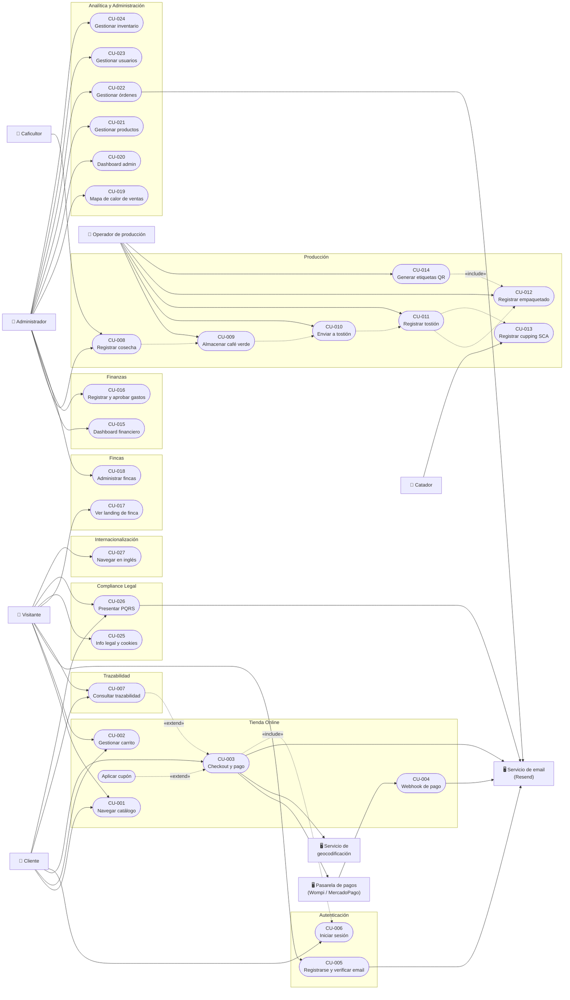

# Casos de Uso Extendidos — DobleYo Café

> Especificación de casos de uso en formato extendido, derivados de los requisitos funcionales (`REQUISITOS_FUNCIONALES.md`) y las historias de usuario (`HISTORIAS_USUARIO.md`).
> Cobertura: CU-001..CU-027 especifican los requisitos de **prioridad P1 (críticos)**; CU-028..CU-037 incorporan los **P2/P3**. Varios RF P2/P3 que son variaciones de un caso existente se integraron como pasos o flujos alternativos del CU correspondiente (RF-005 → CU-001, RF-014 → CU-002, RF-026 → CU-003, RF-056 → CU-007, RF-083 → CU-018, RF-092 → CU-019, RF-116 → CU-025) en lugar de crear casos de uso artificiales.
>
> Convenciones:
> - ID: `CU-XXX`, trazable con `RF-XXX` y `HU-XXX`.
> - «include»: el caso de uso incluido se ejecuta siempre como parte del flujo.
> - «extend»: comportamiento opcional que extiende el caso base en un punto de extensión.
> - Los requisitos de SEO (RF-130..136) y varios de Seguridad (RF-140..146) son requisitos de sistema/transversales sin interacción de actor, por lo que **no se modelan como casos de uso**; aplican como restricciones a todos los CU.

---

## Actores

| Actor | Descripción |
|---|---|
| **Visitante** | Usuario anónimo que navega el sitio público. |
| **Cliente** | Usuario con rol `client`, registrado y con email verificado. |
| **Caficultor** | Usuario con rol `caficultor`. Registra cosechas y opera la app de producción. |
| **Operador de producción** | Rol operativo (admin o caficultor autorizado) que ejecuta almacenamiento, tostión, empaque y etiquetado. |
| **Catador** | Quien registra sesiones de cupping SCA (admin u operador autorizado). |
| **Administrador** | Usuario con rol `admin`. Acceso total al panel `/admin`. |
| **Pasarela de pagos** | Sistema externo (Wompi / MercadoPago) que procesa pagos y notifica por webhook. |
| **Servicio de email** | Sistema externo (Resend) que envía correos transaccionales. |
| **Servicio de geocodificación** | Sistema externo que convierte direcciones en coordenadas lat/lng. |

---

## Índice de Casos de Uso

| ID | Nombre | Actor primario | RF | HU |
|---|---|---|---|---|
| CU-001 | Navegar catálogo de productos | Visitante/Cliente | RF-001..004 | HU-001 |
| CU-002 | Gestionar carrito de compras | Visitante/Cliente | RF-010..013, 015 | HU-002 |
| CU-003 | Realizar checkout y pagar pedido | Cliente | RF-020..025, 027..030, 093 | HU-003 |
| CU-004 | Procesar notificación de pago (webhook) | Pasarela de pagos | RF-029 | HU-003 |
| CU-005 | Registrarse y verificar email | Visitante | RF-040, 041 | HU-006 |
| CU-006 | Iniciar sesión y mantener sesión | Visitante | RF-042..044 | HU-006 |
| CU-007 | Consultar trazabilidad de un lote | Visitante/Cliente | RF-050, 052..055 | HU-005 |
| CU-008 | Registrar cosecha | Caficultor | RF-051, 060 | HU-011 |
| CU-009 | Registrar almacenamiento de café verde | Operador de producción | RF-061 | HU-012 |
| CU-010 | Enviar lote a tostión | Operador de producción | RF-062 | HU-013 |
| CU-011 | Registrar resultado de tostión | Operador de producción | RF-063 | HU-014 |
| CU-012 | Registrar empaquetado | Operador de producción | RF-064 | HU-015 |
| CU-013 | Registrar cupping SCA | Catador | RF-065 | HU-017 |
| CU-014 | Generar etiquetas con QR | Operador de producción | RF-054 | HU-016 |
| CU-015 | Consultar dashboard financiero | Administrador | RF-070..073 | HU-018 |
| CU-016 | Registrar y aprobar gastos | Administrador | RF-074 | HU-019 |
| CU-017 | Ver landing de finca | Visitante | RF-081 | HU-021 |
| CU-018 | Administrar fincas | Administrador | RF-080, 082 | HU-022 |
| CU-019 | Analizar mapa de calor de ventas | Administrador | RF-090, 091 | HU-023 |
| CU-020 | Consultar dashboard administrativo | Administrador | RF-100 | HU-024 |
| CU-021 | Gestionar productos | Administrador | RF-101 | HU-025 |
| CU-022 | Gestionar órdenes | Administrador | RF-102 | HU-026 |
| CU-023 | Gestionar usuarios | Administrador | RF-103 | HU-027 |
| CU-024 | Gestionar inventario | Administrador | RF-104 | HU-024 |
| CU-025 | Consultar información legal y gestionar cookies | Visitante | RF-110..114 | HU-028..030 |
| CU-026 | Presentar PQRS | Cliente/Visitante | RF-115 | HU-031 |
| CU-027 | Navegar el sitio en inglés | Visitante | RF-120..126 | HU-009, HU-032 |
| CU-028 | Ver detalle de producto | Visitante/Cliente | RF-006 | HU-001 |
| CU-029 | Consultar historial de pedidos | Cliente | RF-046 | HU-004 |
| CU-030 | Gestionar perfil de cuenta | Cliente | RF-045 | HU-007 |
| CU-031 | Contactar a DobleYo | Visitante/Cliente | — (sin RF) | HU-008 |
| CU-032 | Consultar dashboard de producción | Administrador | RF-066 | HU-024 |
| CU-033 | Gestionar presupuestos | Administrador | RF-075 | HU-020 |
| CU-034 | Gestionar facturación | Administrador | RF-076 | HU-018 |
| CU-035 | Gestionar blog | Administrador | RF-105 | HU-024 |
| CU-036 | Consultar logs de auditoría | Administrador | — (sin RF) | HU-036 |
| CU-037 | Exportar reportes y datos | Administrador | RF-077, RF-094 | HU-018, HU-023 |

### Relaciones entre casos de uso

- CU-003 «include» CU-006 (el checkout requiere sesión activa).
- CU-003 «extend» **Aplicar cupón de descuento** (punto de extensión: resumen del pedido).
- CU-003 «extend» CU-007 (la confirmación enlaza a la trazabilidad del lote comprado).
- CU-008..CU-012 forman la **cadena de trazabilidad** (RF-050): cada uno precede al siguiente.
- CU-014 «include» CU-012 (solo se etiquetan lotes empaquetados).
- CU-021..CU-024 «include» CU-006 con rol `admin` (RF-044).
- CU-029, CU-030 «include» CU-006 (requieren sesión de cliente).
- CU-037 «extend» CU-015 y CU-019 (punto de extensión: botón de exportación en cada dashboard).

### Diagrama de casos de uso

> Mermaid no tiene notación UML nativa de casos de uso; se aproxima con un diagrama de flujo: actores como rectángulos, casos de uso como elipses (nodos redondeados), módulos como contenedores. Las flechas punteadas indican «include»/«extend».
> El diagrama muestra la vista P1 (CU-001..CU-027); los CU P2/P3 se omiten para mantenerlo legible.

---

## Módulo: Tienda Online

### CU-001 — Navegar catálogo de productos

| Campo | Valor |
|---|---|
| **Actor primario** | Visitante / Cliente |
| **Actores secundarios** | — |
| **Prioridad / Fase** | P1 / Fase 1 (RF-005: P2 / Fase 2) |
| **Trazabilidad** | RF-001, RF-002, RF-003, RF-004, RF-005 · HU-001 |

**Descripción:** El usuario explora el catálogo de cafés y accesorios, aplicando filtros y ordenamientos para encontrar el producto que busca.

**Precondiciones:**
- Existen productos activos en la base de datos (RF-004: el catálogo se sirve desde BD, no desde archivos estáticos).

**Flujo principal:**
1. El usuario accede a `/tienda`.
2. El sistema consulta los productos activos en la BD y muestra el grid con imagen, nombre, precio, origen, proceso y tueste (RF-001), con badge de "Nuevo", "Más vendido" o "Agotado" según corresponda (RF-005).
3. El usuario aplica uno o más filtros: categoría, origen, proceso, nivel de tueste, rango de precio (RF-002).
4. El sistema actualiza el grid mostrando solo los productos que cumplen todos los filtros.
5. El usuario selecciona un criterio de ordenamiento (precio asc/desc, nombre A-Z/Z-A, más recientes) (RF-003).
6. El sistema reordena el grid.
7. El usuario selecciona un producto y el sistema navega a su página de detalle (CU-028).

**Flujos alternativos:**
- **3a. Sin filtros:** el usuario navega el catálogo completo; el flujo continúa en el paso 5 o 7.
- **4a. Sin resultados:** ningún producto cumple los filtros; el sistema muestra un estado vacío con mensaje y opción de limpiar filtros.

**Flujos de excepción:**
- **2a. Error de BD:** el sistema muestra un mensaje de error y un estado de reintento; no muestra datos parciales o desactualizados.

**Postcondiciones:**
- Ninguna persistente (consulta de solo lectura).

---

### CU-002 — Gestionar carrito de compras

| Campo | Valor |
|---|---|
| **Actor primario** | Visitante / Cliente |
| **Actores secundarios** | — |
| **Prioridad / Fase** | P1 / Fases 1–4 (RF-014: P2 / Fase 4) |
| **Trazabilidad** | RF-010, RF-011, RF-012, RF-013, RF-014, RF-015 · HU-002 |

**Descripción:** El usuario acumula productos en un carrito persistente, modifica cantidades y visualiza el subtotal antes de iniciar el checkout.

**Precondiciones:**
- El producto a agregar está activo en el catálogo.

**Flujo principal:**
1. El usuario pulsa "Agregar al carrito" desde la tienda o el detalle de producto.
2. El sistema valida el stock disponible del producto (RF-014), agrega el ítem al carrito en `localStorage` y actualiza el contador del header (RF-013).
3. Si el usuario está autenticado, el sistema sincroniza el carrito con la BD (RF-010).
4. El usuario accede a `/cart` y ve por cada ítem: thumbnail, nombre, precio unitario, cantidad y total (RF-015).
5. El usuario modifica la cantidad de un ítem o lo elimina (RF-011).
6. El sistema recalcula el subtotal en tiempo real (RF-012).
7. El usuario pulsa "Proceder al pago" y el sistema inicia CU-003.

**Flujos alternativos:**
- **1a. Producto ya en el carrito:** el sistema incrementa la cantidad del ítem existente en lugar de duplicarlo.
- **4a. Carrito vacío:** el sistema muestra estado vacío con enlace a la tienda; el flujo termina.
- **3a. Usuario inicia sesión con carrito local:** el sistema fusiona el carrito de `localStorage` con el carrito guardado en BD.

**Flujos de excepción:**
- **2a. Stock insuficiente (RF-014):** el sistema no agrega el ítem (o limita la cantidad al disponible) e informa la existencia actual.
- **5a. Cantidad inválida (≤ 0 o no numérica):** el sistema rechaza el cambio y conserva la cantidad anterior.

**Postcondiciones:**
- El carrito queda persistido en `localStorage` (y en BD si hay sesión) con las cantidades actualizadas.

---

### CU-003 — Realizar checkout y pagar pedido

| Campo | Valor |
|---|---|
| **Actor primario** | Cliente |
| **Actores secundarios** | Pasarela de pagos (Wompi / MercadoPago), Servicio de geocodificación, Servicio de email |
| **Prioridad / Fase** | P1 / Fase 4 |
| **Trazabilidad** | RF-020, RF-021, RF-022, RF-023, RF-024, RF-025, RF-026 (P2), RF-027, RF-028, RF-030, RF-093 · HU-003 |
| **Relaciones** | «include» CU-006 · «extend» Aplicar cupón · «extend» CU-007 |

**Descripción:** El cliente ingresa sus datos de envío, selecciona un método de pago, completa la transacción y recibe la confirmación de su pedido.

**Precondiciones:**
- El carrito contiene al menos un ítem.
- El usuario está autenticado (RF-020); si no, el sistema ejecuta CU-006 antes de continuar.

**Flujo principal:**
1. El cliente accede a `/checkout` desde el carrito.
2. El sistema verifica la sesión («include» CU-006).
3. El cliente diligencia los datos de envío: nombre completo, documento, departamento, ciudad, barrio, dirección, teléfono, email y notas (RF-021).
4. El sistema valida el formulario y geocodifica la dirección para obtener coordenadas lat/lng (RF-022, RF-093).
5. El sistema muestra el resumen: ítems, subtotal, IVA 19 % sobre productos gravados (RF-025), costo de envío según la ubicación del destinatario (RF-026) y total.
   - *Punto de extensión — Aplicar cupón:* el cliente ingresa un código; el sistema valida vigencia y límite de uso y recalcula el total.
6. El cliente selecciona el método de pago Wompi: PSE, tarjeta crédito/débito, Nequi o Bancolombia QR (RF-023).
7. El sistema redirige/abre el widget de la pasarela y el cliente completa el pago.
8. La pasarela retorna la transacción aprobada.
9. El sistema crea la orden en BD con ítems, totales, dirección, método de pago, referencia de transacción y coordenadas, en estado `paid` (RF-027).
10. El sistema envía el email de confirmación con el resumen de la orden (RF-028) y descuenta/actualiza el uso del cupón si aplicó.
11. El sistema muestra la página de confirmación con número de referencia, resumen y datos de trazabilidad del lote (RF-030), con enlace a CU-007.

**Flujos alternativos:**
- **6a. Pago con MercadoPago (RF-024):** el cliente elige la pasarela alternativa; el flujo continúa igual desde el paso 7.
- **8a. Pago pendiente (ej. PSE en proceso):** el sistema crea la orden en estado `pending` y la confirmación definitiva llega por CU-004; la página de confirmación indica que el pago está en verificación.
- **4a. Geocodificación sin resultado:** el sistema registra la orden sin coordenadas y marca la dirección para geocodificación posterior; el flujo no se bloquea.

**Flujos de excepción:**
- **4b. Formulario inválido:** el sistema marca los campos con error y no permite continuar.
- **5a. Cupón inválido, vencido o agotado:** el sistema muestra el motivo del rechazo y mantiene el total sin descuento.
- **8b. Pago rechazado:** el sistema muestra el error de la pasarela y permite reintentar con otro método; no se crea orden en estado `paid`.
- **9a. Error al crear la orden con pago ya aprobado:** el sistema registra el incidente (log/auditoría) con la referencia de la transacción para conciliación manual; muestra al cliente un mensaje con la referencia de pago.

**Postcondiciones:**
- Orden registrada en BD con estado acorde al resultado del pago, con referencia de transacción y coordenadas.
- Email de confirmación enviado (si el pago fue aprobado).
- Carrito vaciado.

---

### CU-004 — Procesar notificación de pago (webhook)

| Campo | Valor |
|---|---|
| **Actor primario** | Pasarela de pagos (Wompi / MercadoPago) |
| **Actores secundarios** | Servicio de email |
| **Prioridad / Fase** | P1 / Fase 4 |
| **Trazabilidad** | RF-029 · HU-003 |

**Descripción:** La pasarela notifica de forma asíncrona el cambio de estado de una transacción y el sistema actualiza la orden correspondiente.

**Precondiciones:**
- Existe una orden con la referencia de transacción notificada.

**Flujo principal:**
1. La pasarela envía un POST al endpoint de webhook con el evento de la transacción.
2. El sistema valida la firma/secreto del evento (`WOMPI_EVENTS_SECRET` o equivalente de MercadoPago).
3. El sistema localiza la orden por referencia de transacción.
4. El sistema actualiza el estado de la orden (`paid`, `declined`, `voided`) según el evento (RF-029).
5. Si la transición es a `paid` y no se había confirmado antes, el sistema envía el email de confirmación y actualiza el uso del cupón si aplica.
6. El sistema responde `200 OK` a la pasarela.

**Flujos alternativos:**
- **4a. Evento duplicado (mismo estado ya aplicado):** el sistema responde `200 OK` sin efectos adicionales (idempotencia).

**Flujos de excepción:**
- **2a. Firma inválida:** el sistema responde `4xx`, no modifica datos y registra el intento en auditoría.
- **3a. Orden no encontrada:** el sistema registra el evento para conciliación manual y responde `200` para evitar reintentos infinitos de la pasarela.

**Postcondiciones:**
- El estado de la orden refleja el estado real de la transacción en la pasarela.

---

### CU-028 — Ver detalle de producto

| Campo | Valor |
|---|---|
| **Actor primario** | Visitante / Cliente |
| **Prioridad / Fase** | P2 / Fase 2 |
| **Trazabilidad** | RF-006 · HU-001 |

**Descripción:** El usuario consulta la página de detalle de un producto con galería, descripción extendida, notas de cata y perfil visual de tueste antes de decidir la compra.

**Precondiciones:**
- El producto existe y está activo en el catálogo.

**Flujo principal:**
1. El usuario accede al detalle desde el grid de la tienda (CU-001) o por URL directa.
2. El sistema muestra: galería de imágenes, descripción extendida, notas de cata y perfil visual de tueste (RF-006), junto con precio, origen y proceso.
3. El usuario navega la galería y selecciona la cantidad.
4. El usuario agrega el producto al carrito (CU-002).

**Flujos alternativos:**
- **2a. Producto agotado:** el sistema muestra el badge "Agotado" (RF-005) y deshabilita el botón de agregar al carrito.
- **4a. Producto de una finca vinculada:** el usuario navega a la landing de la finca de origen desde el badge (RF-083 → CU-017).

**Flujos de excepción:**
- **1a. Producto inexistente o inactivo:** el sistema responde 404 con enlace de retorno a la tienda.

**Postcondiciones:**
- Ninguna persistente (consulta de solo lectura).

---

## Módulo: Autenticación

### CU-005 — Registrarse y verificar email

| Campo | Valor |
|---|---|
| **Actor primario** | Visitante |
| **Actores secundarios** | Servicio de email |
| **Prioridad / Fase** | P1 / Fase 1 |
| **Trazabilidad** | RF-040, RF-041 · HU-006 |

**Descripción:** El visitante crea una cuenta con email y contraseña y verifica su email mediante un enlace con token de propósito específico.

**Precondiciones:**
- El email no está registrado previamente.

**Flujo principal:**
1. El visitante accede al formulario de registro.
2. Diligencia email, nombre, apellido y contraseña (mínimo 8 caracteres, al menos 1 número y 1 mayúscula) (RF-040).
3. El sistema valida el formulario y crea el usuario con rol `client` y estado "no verificado".
4. El sistema genera un JWT de verificación de propósito específico (no reutiliza el access token) y envía el email con el enlace (RF-041).
5. El usuario abre el enlace de verificación.
6. El sistema valida el token, marca el email como verificado y muestra confirmación.
7. El usuario puede iniciar sesión (CU-006).

**Flujos alternativos:**
- **5a. Token vencido:** el sistema ofrece reenviar el email de verificación con un token nuevo.

**Flujos de excepción:**
- **2a. Contraseña débil o campos inválidos:** el sistema muestra los errores de validación y no crea la cuenta.
- **3a. Email ya registrado:** el sistema informa el conflicto sin revelar datos de la cuenta existente.
- **4a. Fallo del servicio de email:** la cuenta queda creada; el sistema informa que el correo no pudo enviarse y ofrece reintento.

**Postcondiciones:**
- Usuario creado en BD; email verificado tras completar el flujo.

---

### CU-006 — Iniciar sesión y mantener sesión

| Campo | Valor |
|---|---|
| **Actor primario** | Visitante (con cuenta) |
| **Actores secundarios** | — |
| **Prioridad / Fase** | P1 / Fase 1 |
| **Trazabilidad** | RF-042, RF-043, RF-044 · HU-006 |

**Descripción:** El usuario se autentica con email y contraseña; el sistema emite tokens JWT en cookies HttpOnly y renueva la sesión de forma transparente.

**Precondiciones:**
- Cuenta creada y email verificado (CU-005).

**Flujo principal:**
1. El usuario ingresa email y contraseña en el formulario de login.
2. El sistema valida las credenciales.
3. El sistema emite access token (15 min) y refresh token (7 días) en cookies HttpOnly (RF-042).
4. El sistema redirige según rol: `client` → tienda/cuenta; `admin`/`caficultor` → panel correspondiente (RF-044).
5. Mientras la sesión está activa, el cliente renueva el access token automáticamente antes de expirar, sin intervención del usuario (RF-043).
6. Al acceder a endpoints protegidos, el middleware `requireRole()` verifica el rol (RF-044).

**Flujos alternativos:**
- **5a. Refresh token vencido:** el sistema cierra la sesión y redirige al login conservando la URL de retorno.
- **6a. Cierre de sesión:** el usuario pulsa "Cerrar sesión"; el sistema invalida las cookies.

**Flujos de excepción:**
- **2a. Credenciales inválidas:** el sistema muestra error genérico (sin revelar si el email existe). Aplica rate limiting (RF-143).
- **2b. Email no verificado:** el sistema bloquea el acceso e indica cómo reenviar la verificación.
- **6b. Rol insuficiente:** el sistema responde `403` y la UI redirige o muestra acceso denegado.

**Postcondiciones:**
- Sesión activa con tokens en cookies HttpOnly; ningún token en `localStorage` (RF-142).

---

## Módulo: Cuenta del Cliente y Contacto

### CU-029 — Consultar historial de pedidos

| Campo | Valor |
|---|---|
| **Actor primario** | Cliente |
| **Prioridad / Fase** | P2 / Fase 4 |
| **Trazabilidad** | RF-046 · HU-004 |
| **Relaciones** | «include» CU-006 |

**Descripción:** El cliente consulta sus pedidos anteriores con estado actual para rastrear sus compras.

**Precondiciones:**
- Sesión activa de cliente («include» CU-006).
- El cliente tiene al menos un pedido (CU-003).

**Flujo principal:**
1. El cliente accede a su cuenta y abre el historial de pedidos (RF-046).
2. El sistema lista los pedidos del cliente con fecha, total y estado (pendiente, pagado, en proceso, enviado, entregado).
3. El cliente abre el detalle de un pedido: ítems, cantidades, precios y dirección de envío.
4. Si el pedido está enviado, el sistema muestra el enlace de seguimiento del envío.

**Flujos alternativos:**
- **2a. Sin pedidos:** el sistema muestra estado vacío con enlace a la tienda.

**Flujos de excepción:**
- **3a. Intento de acceder a un pedido de otro usuario:** el sistema responde 403 (el filtro por usuario aplica en el backend, no solo en la UI).

**Postcondiciones:**
- Ninguna persistente (consulta de solo lectura).

---

### CU-030 — Gestionar perfil de cuenta

| Campo | Valor |
|---|---|
| **Actor primario** | Cliente |
| **Prioridad / Fase** | P2 / Fase 4 |
| **Trazabilidad** | RF-045 · HU-007 |
| **Relaciones** | «include» CU-006 |

**Descripción:** El cliente consulta y edita sus datos personales para mantener actualizada su información de envío.

**Precondiciones:**
- Sesión activa de cliente («include» CU-006).

**Flujo principal:**
1. El cliente accede a su cuenta y abre la sección de perfil.
2. El sistema muestra los datos editables: nombre, apellido, dirección, teléfono, ciudad, departamento (RF-045).
3. El cliente modifica los campos y guarda.
4. El sistema valida los datos, persiste los cambios y confirma.

**Flujos de excepción:**
- **4a. Datos inválidos (ej. teléfono con formato incorrecto):** el sistema marca los errores y no guarda.

**Postcondiciones:**
- Perfil actualizado; el checkout (CU-003) prellena los datos de envío con esta información.

---

### CU-031 — Contactar a DobleYo

| Campo | Valor |
|---|---|
| **Actor primario** | Visitante / Cliente |
| **Actores secundarios** | Servicio de email |
| **Prioridad / Fase** | — (sin RF asociado; ver nota) |
| **Trazabilidad** | HU-008 |

> **Nota:** HU-008 no tiene requisito funcional asociado en `REQUISITOS_FUNCIONALES.md`. Se recomienda formalizar un RF (ej. RF-007) para cerrar la brecha de trazabilidad. La funcionalidad ya existe en `/contacto`.

**Descripción:** El usuario envía un mensaje al equipo de DobleYo para resolver dudas, hacer sugerencias o reportar problemas.

**Precondiciones:**
- Ninguna (formulario público).

**Flujo principal:**
1. El usuario accede a `/contacto` y diligencia: nombre, email, asunto, mensaje.
2. El sistema valida el formulario (con rate limiting, RF-143).
3. El sistema guarda el mensaje en BD y notifica al administrador por email.
4. El sistema muestra confirmación visual y envía email de confirmación al usuario.

**Flujos de excepción:**
- **2a. Datos inválidos:** el sistema marca los errores y no envía.
- **3a/4a. Fallo del servicio de email:** el mensaje queda guardado en BD; el sistema informa que la notificación por correo falló.

**Postcondiciones:**
- Mensaje persistido; administrador notificado; usuario con confirmación.

---

## Módulo: Trazabilidad

### CU-007 — Consultar trazabilidad de un lote

| Campo | Valor |
|---|---|
| **Actor primario** | Visitante / Cliente (comprador con empaque físico) |
| **Actores secundarios** | — |
| **Prioridad / Fase** | P1 / Fase 5 |
| **Trazabilidad** | RF-050, RF-052, RF-053, RF-054, RF-055, RF-056 (P2) · HU-005 |

**Descripción:** El comprador escanea el QR del empaque (o ingresa el código manualmente) y consulta la cadena completa de trazabilidad del lote.

**Precondiciones:**
- El lote existe y tiene código único `DBY-YYYY-MM-XXX` (RF-051).
- La etiqueta con QR fue generada (CU-014).

**Flujo principal:**
1. El comprador escanea el QR del empaque con la cámara de su móvil (RF-053).
2. El QR resuelve a `dobleyo.cafe/t/{LOT_CODE}` (RF-054) y el navegador abre la página.
3. El sistema consulta la cadena del lote: cosecha → almacenamiento → tostión → empaque → venta (RF-050).
4. El sistema muestra el timeline visual con todos los pasos (RF-052) y los datos: finca, altitud, variedad, proceso, fecha de cosecha, fecha de tostión, perfil de tueste, puntuación SCA y empaquetador (RF-055).
5. El comprador explora los detalles de cada etapa.
6. El comprador navega a la landing de la finca de origen desde el enlace de la página (RF-056 → CU-017).

**Flujos alternativos:**
- **1a. Búsqueda manual:** el usuario accede a `/trazabilidad` e ingresa el código del lote; el flujo continúa en el paso 3.
- **1b. Cámara no disponible o sin permiso:** el sistema ofrece la búsqueda manual (flujo 1a).

**Flujos de excepción:**
- **3a. Código inexistente o con formato inválido:** el sistema muestra "Lote no encontrado" con la opción de verificar el código e intentar de nuevo.
- **3b. Cadena incompleta (lote en proceso):** el sistema muestra el timeline hasta la última etapa registrada, indicando las etapas pendientes.

**Postcondiciones:**
- Ninguna persistente (consulta pública de solo lectura).

---

## Módulo: Producción

> Los CU-008 a CU-012 forman la cadena de trazabilidad (RF-050): cada etapa exige que la anterior esté registrada y deja el lote en el estado que habilita la siguiente. Todos requieren sesión con rol autorizado («include» CU-006) y registran auditoría (HU-036).

### CU-008 — Registrar cosecha

| Campo | Valor |
|---|---|
| **Actor primario** | Caficultor / Administrador |
| **Prioridad / Fase** | P1 / Fase 5 |
| **Trazabilidad** | RF-051, RF-060 · HU-011 |

**Descripción:** El caficultor registra una cosecha en finca, lo que crea el lote e inicia su cadena de trazabilidad.

**Precondiciones:**
- Sesión activa con rol `caficultor` o `admin`.
- La finca está registrada en el sistema.

**Flujo principal:**
1. El actor accede a `/admin/harvest`.
2. Diligencia: finca, variedad, peso (kg), fecha de cosecha, proceso y notas (RF-060).
3. El sistema valida los datos (peso > 0, fecha no futura).
4. El sistema genera el código único de lote `DBY-YYYY-MM-XXX` con consecutivo del mes (RF-051).
5. El sistema crea el lote en estado "cosechado" y registra la acción en auditoría.
6. El sistema muestra confirmación con el código del lote generado.

**Flujos de excepción:**
- **3a. Datos inválidos:** el sistema muestra los errores por campo y no crea el registro.
- **4a. Colisión de consecutivo (concurrencia):** el sistema reintenta la generación del código dentro de la transacción.

**Postcondiciones:**
- Lote creado con código único, en estado "cosechado", listo para CU-009.

---

### CU-009 — Registrar almacenamiento de café verde

| Campo | Valor |
|---|---|
| **Actor primario** | Operador de producción |
| **Prioridad / Fase** | P1 / Fase 5 |
| **Trazabilidad** | RF-061 · HU-012 |

**Descripción:** El operador registra el ingreso del café verde al almacén con sus datos de secado y humedad, continuando la trazabilidad del lote.

**Precondiciones:**
- Lote en estado "cosechado" (CU-008).

**Flujo principal:**
1. El operador accede a `/admin/inventory-storage` y selecciona el lote cosechado.
2. Diligencia los datos de humedad y secado (RF-061), peso de ingreso y ubicación de almacenamiento.
3. El sistema valida los datos y registra el movimiento en el inventario de café verde.
4. El sistema actualiza el estado del lote a "almacenado" y registra auditoría.

**Flujos de excepción:**
- **1a. El lote no está en estado "cosechado":** el sistema no lo lista como seleccionable, preservando el orden de la cadena.
- **2a. Peso de ingreso mayor al peso cosechado:** el sistema advierte la inconsistencia y exige corrección o justificación en notas.

**Postcondiciones:**
- Inventario verde actualizado; lote en estado "almacenado", listo para CU-010.

---

### CU-010 — Enviar lote a tostión

| Campo | Valor |
|---|---|
| **Actor primario** | Operador de producción |
| **Prioridad / Fase** | P1 / Fase 5 |
| **Trazabilidad** | RF-062 · HU-013 |

**Descripción:** El operador selecciona un lote de café verde almacenado y registra su envío al tostador, vinculado al lote original.

**Precondiciones:**
- Lote en estado "almacenado" con inventario verde disponible (CU-009).

**Flujo principal:**
1. El operador accede a `/admin/send-roasting` y selecciona el lote verde.
2. Diligencia peso enviado, tostador de destino y fecha de envío.
3. El sistema valida que el peso enviado no exceda el disponible.
4. El sistema crea el registro de envío vinculado al lote verde original (RF-062), descuenta el inventario y cambia el estado a "en tostión".

**Flujos de excepción:**
- **3a. Peso enviado mayor al disponible:** el sistema rechaza la operación indicando el disponible actual.

**Postcondiciones:**
- Lote en estado "en tostión"; inventario verde descontado; listo para CU-011.

---

### CU-011 — Registrar resultado de tostión

| Campo | Valor |
|---|---|
| **Actor primario** | Operador de producción / Tostador |
| **Prioridad / Fase** | P1 / Fase 5 |
| **Trazabilidad** | RF-063 · HU-014 |

**Descripción:** El actor registra el resultado de la tostión con los datos de curva y peso final, y el sistema calcula la merma.

**Precondiciones:**
- Lote en estado "en tostión" (CU-010).

**Flujo principal:**
1. El actor accede a `/admin/roast-retrieval` y selecciona el lote en tostión.
2. Diligencia: perfil de tueste, temperatura, duración, peso final, first crack, second crack (RF-063).
3. El sistema valida que el peso final sea menor al peso enviado y calcula la merma % (RF-063).
4. El sistema registra el batch de tostión, actualiza el estado del lote a "tostado" y registra auditoría.

**Flujos alternativos:**
- **3a. Merma fuera de rango típico (ej. > 25 %):** el sistema advierte el valor atípico y solicita confirmación antes de guardar.

**Flujos de excepción:**
- **3b. Peso final ≥ peso enviado:** el sistema rechaza el registro por inconsistencia física.

**Postcondiciones:**
- Batch de tostión registrado con curva y merma; lote en estado "tostado", listo para CU-012 y CU-013.

---

### CU-012 — Registrar empaquetado

| Campo | Valor |
|---|---|
| **Actor primario** | Operador de producción |
| **Prioridad / Fase** | P1 / Fase 5 |
| **Trazabilidad** | RF-064 · HU-015 |

**Descripción:** El operador registra el empaquetado del café tostado: peso por bolsa, cantidad de bolsas y tipo de empaque.

**Precondiciones:**
- Lote en estado "tostado" con inventario tostado disponible (CU-011).

**Flujo principal:**
1. El operador accede a `/admin/packaging` y selecciona el lote tostado.
2. Diligencia: peso por bolsa, cantidad de bolsas, tipo de empaque (RF-064).
3. El sistema valida que `peso por bolsa × cantidad` no exceda el peso tostado disponible.
4. El sistema registra el empaquetado, descuenta el inventario tostado y actualiza el estado del lote a "empaquetado".

**Flujos alternativos:**
- **4a. Empaquetado parcial:** queda saldo de café tostado del lote; el lote admite empaquetados adicionales posteriores.

**Flujos de excepción:**
- **3a. Cantidad excede el disponible:** el sistema rechaza la operación indicando el saldo disponible.

**Postcondiciones:**
- Producto final registrado y disponible; lote en estado "empaquetado", habilitado para CU-014.

---

### CU-013 — Registrar cupping SCA

| Campo | Valor |
|---|---|
| **Actor primario** | Catador / Administrador |
| **Prioridad / Fase** | P1 / Fase 5 |
| **Trazabilidad** | RF-065 · HU-017 |

**Descripción:** El catador registra una sesión de cupping bajo protocolo SCA y el sistema calcula el puntaje total del lote, visible luego en la trazabilidad pública.

**Precondiciones:**
- Lote con tostión registrada (CU-011).

**Flujo principal:**
1. El catador selecciona el lote tostado y abre el formulario de cupping.
2. Diligencia las puntuaciones: aroma, sabor, acidez, cuerpo, balance, uniformidad, limpieza, dulzura, aftertaste, overall (RF-065).
3. El sistema valida los rangos SCA de cada atributo y calcula el puntaje total (RF-065).
4. El sistema guarda la sesión asociada al lote y registra auditoría.
5. El puntaje queda disponible para la página de trazabilidad (CU-007, RF-055).

**Flujos de excepción:**
- **3a. Puntuación fuera de rango:** el sistema marca el campo y no permite guardar.

**Postcondiciones:**
- Sesión de cupping registrada con puntaje total asociado al lote.

---

### CU-014 — Generar etiquetas con QR

| Campo | Valor |
|---|---|
| **Actor primario** | Operador de producción / Administrador |
| **Prioridad / Fase** | P1 / Fase 5 |
| **Trazabilidad** | RF-054 · HU-016 |
| **Relaciones** | «include» CU-012 (solo lotes empaquetados) |

**Descripción:** El actor genera etiquetas con código QR apuntando a la trazabilidad pública del lote, para impresión y adhesión al empaque.

**Precondiciones:**
- Lote en estado "empaquetado" (CU-012).

**Flujo principal:**
1. El actor accede a `/admin/etiquetas` y selecciona el lote empaquetado.
2. El sistema genera el QR con la URL `dobleyo.cafe/t/{LOT_CODE}` (RF-054).
3. El sistema compone la etiqueta con el QR y los metadatos del lote y la registra en `generated_labels`.
4. El actor previsualiza, ajusta cantidad de copias y descarga/imprime.

**Flujos de excepción:**
- **1a. Lote sin empaquetado registrado:** el sistema no lo lista como seleccionable.

**Postcondiciones:**
- Etiqueta registrada y disponible para impresión; el QR resuelve a CU-007.

---

### CU-032 — Consultar dashboard de producción

| Campo | Valor |
|---|---|
| **Actor primario** | Administrador |
| **Prioridad / Fase** | P2 / Fase 5 |
| **Trazabilidad** | RF-066 · HU-024 |

**Descripción:** El administrador consulta las métricas operativas de producción para monitorear el estado de la planta.

**Precondiciones:**
- Sesión con rol `admin`.
- Existen registros de la cadena de producción (CU-008..CU-013).

**Flujo principal:**
1. El administrador accede al dashboard de producción.
2. El sistema calcula y muestra: lotes en proceso (por etapa), producción del mes, merma promedio y cupping promedio (RF-066).
3. El administrador navega desde cada métrica al detalle de los lotes que la componen.

**Flujos alternativos:**
- **2a. Mes sin producción:** el sistema muestra las métricas en cero indicándolo explícitamente.

**Postcondiciones:**
- Ninguna persistente (consulta de solo lectura).

---

## Módulo: Finanzas

### CU-015 — Consultar dashboard financiero

| Campo | Valor |
|---|---|
| **Actor primario** | Administrador |
| **Prioridad / Fase** | P1 / Fase 6 |
| **Trazabilidad** | RF-070, RF-071, RF-072, RF-073 · HU-018 |

**Descripción:** El administrador consulta el estado financiero: P&L por período, flujo de caja, margen por producto y costo por kg producido, sobre una contabilidad de doble partida.

**Precondiciones:**
- Sesión con rol `admin`.
- Plan de cuentas configurado (RF-070) y asientos registrados con débitos = créditos (RF-071).

**Flujo principal:**
1. El administrador accede a `/admin/finanzas`.
2. Selecciona el período de análisis.
3. El sistema calcula y muestra: P&L del período, flujo de caja y margen por producto (RF-072).
4. El sistema muestra el costo por kg producido: materia prima + mano de obra + costos fijos + merma (RF-073).
5. El administrador navega entre períodos o productos para comparar.

**Flujos alternativos:**
- **3a. Período sin movimientos:** el sistema muestra el dashboard con valores en cero y lo indica explícitamente.

**Flujos de excepción:**
- **3b. Asientos descuadrados detectados:** el sistema alerta la inconsistencia contable e identifica los asientos afectados (la validación de RF-071 debe impedir que ocurra en el registro).

**Postcondiciones:**
- Ninguna persistente (consulta de solo lectura).

---

### CU-016 — Registrar y aprobar gastos

| Campo | Valor |
|---|---|
| **Actor primario** | Administrador |
| **Prioridad / Fase** | P1 / Fase 6 |
| **Trazabilidad** | RF-074 · HU-019 |

**Descripción:** El administrador registra gastos operativos con categorización y flujo de aprobación, alimentando el costeo y la contabilidad.

**Precondiciones:**
- Sesión con rol `admin`.
- Categorías de gasto y plan de cuentas configurados.

**Flujo principal:**
1. El administrador registra un gasto: fecha, categoría (materia prima, mano de obra, servicios, transporte), monto, descripción y soporte.
2. El sistema valida los datos y guarda el gasto en estado "pendiente de aprobación" (RF-074).
3. Un administrador (idealmente distinto del creador) revisa y aprueba el gasto.
4. El sistema marca el gasto como aprobado, genera el asiento contable asociado (RF-071) y registra auditoría.

**Flujos alternativos:**
- **3a. Gasto rechazado:** el aprobador registra el motivo; el gasto queda en estado "rechazado" y no genera asiento.

**Flujos de excepción:**
- **1a. Monto inválido (≤ 0):** el sistema rechaza el registro.

**Postcondiciones:**
- Gasto registrado con su estado de aprobación; si fue aprobado, asiento contable generado.

---

### CU-033 — Gestionar presupuestos

| Campo | Valor |
|---|---|
| **Actor primario** | Administrador |
| **Prioridad / Fase** | P2 / Fase 6 |
| **Trazabilidad** | RF-075 · HU-020 |

**Descripción:** El administrador crea presupuestos por período con sus líneas y compara la ejecución real contra lo presupuestado.

**Precondiciones:**
- Sesión con rol `admin`.
- Plan de cuentas y categorías de gasto configurados.

**Flujo principal:**
1. El administrador crea un presupuesto indicando período (mensual/trimestral) y líneas por categoría con montos (RF-075).
2. El sistema valida que el período no tenga otro presupuesto activo y guarda.
3. Durante la ejecución, el sistema calcula el comparativo presupuesto vs. gastos reales aprobados (CU-016) por línea.
4. El administrador consulta el comparativo con desviaciones absolutas y porcentuales (RF-075).

**Flujos alternativos:**
- **4a. Ajuste de presupuesto:** el administrador modifica líneas de un presupuesto vigente; el sistema conserva el historial del valor anterior.

**Flujos de excepción:**
- **2a. Período con presupuesto existente:** el sistema rechaza la creación y ofrece editar el vigente.

**Postcondiciones:**
- Presupuesto persistido; comparativo disponible en el dashboard financiero (CU-015).

---

### CU-034 — Gestionar facturación

| Campo | Valor |
|---|---|
| **Actor primario** | Administrador |
| **Prioridad / Fase** | P2 / Fase 6 |
| **Trazabilidad** | RF-076 · HU-018 |

**Descripción:** El administrador registra facturas de venta y compra con trazabilidad a los asientos contables de doble partida.

**Precondiciones:**
- Sesión con rol `admin`.
- Plan de cuentas configurado (RF-070).

**Flujo principal:**
1. El administrador registra una factura (venta o compra): tercero, fecha, ítems, impuestos y totales (RF-076).
2. El sistema valida los datos y genera el asiento contable asociado con débitos = créditos (RF-071).
3. El sistema vincula factura ↔ asiento para trazabilidad bidireccional (RF-076).
4. Los pagos recibidos/realizados se aplican a la factura (tablas `payments` + `payment_allocations`), actualizando su saldo.

**Flujos alternativos:**
- **4a. Pago parcial o multi-factura:** el sistema distribuye el pago entre facturas según la asignación indicada.

**Flujos de excepción:**
- **2a. Asiento descuadrado:** el sistema rechaza el registro (la validación de RF-071 es bloqueante).

**Postcondiciones:**
- Factura registrada con asiento contable vinculado y saldo actualizado.

---

## Módulo: Fincas

### CU-017 — Ver landing de finca

| Campo | Valor |
|---|---|
| **Actor primario** | Visitante / Cliente |
| **Prioridad / Fase** | P1 / Fase 7 |
| **Trazabilidad** | RF-081 · HU-021 |

**Descripción:** El visitante consulta la página pública de una finca con su historia, caficultor, galería, mapa y cafés disponibles.

**Precondiciones:**
- La finca existe, está activa y tiene slug asignado (RF-080).

**Flujo principal:**
1. El visitante accede a `/finca/{slug}` (desde la trazabilidad, la tienda o el listado de fincas).
2. El sistema carga la finca por slug y muestra: hero con foto, nombre, altitud y región; sección del caficultor con foto y biografía; galería; mapa con ubicación; y cafés de esa finca (RF-081).
3. El visitante navega a un café de la finca (CU-001) o a la trazabilidad de un lote (CU-007).

**Flujos de excepción:**
- **2a. Slug inexistente:** el sistema responde 404 con enlace al listado de fincas.

**Postcondiciones:**
- Ninguna persistente (consulta pública de solo lectura).

---

### CU-018 — Administrar fincas

| Campo | Valor |
|---|---|
| **Actor primario** | Administrador |
| **Prioridad / Fase** | P1 / Fase 7 |
| **Trazabilidad** | RF-080, RF-082, RF-083 (P2) · HU-022 |

**Descripción:** El administrador crea, edita y gestiona las fincas proveedoras con todos sus datos públicos y de origen.

**Precondiciones:**
- Sesión con rol `admin`.

**Flujo principal:**
1. El administrador accede al CRUD de fincas en el panel admin (RF-082).
2. Crea o edita una finca: nombre, slug, región, departamento, altitud, coordenadas, descripción, historia, variedades, procesos, certificaciones, imágenes y datos del caficultor (RF-080).
3. El sistema valida unicidad del slug y formato de coordenadas.
4. El administrador previsualiza la landing (RF-082).
5. El administrador vincula la finca con sus lotes y productos de la tienda, lo que habilita el badge clickeable de origen en el catálogo (RF-083).
6. El administrador guarda; el sistema persiste y registra auditoría.

**Flujos alternativos:**
- **5a. Desactivar finca:** la finca deja de mostrarse públicamente pero conserva su vínculo histórico con lotes ya trazados.

**Flujos de excepción:**
- **3a. Slug duplicado:** el sistema rechaza el guardado y sugiere un slug alternativo.

**Postcondiciones:**
- Finca creada/actualizada; su landing pública (CU-017) refleja los cambios.

---

## Módulo: Analítica y Administración

### CU-019 — Analizar mapa de calor de ventas

| Campo | Valor |
|---|---|
| **Actor primario** | Administrador |
| **Actores secundarios** | MercadoLibre (fuente de datos) |
| **Prioridad / Fase** | P1 / Fase 8 |
| **Trazabilidad** | RF-090, RF-091, RF-092 (P2) (y RF-093 como precondición de datos) · HU-023 |

**Descripción:** El administrador analiza la concentración geográfica de ventas combinando ventas web y de MercadoLibre en un mapa de calor Leaflet.

**Precondiciones:**
- Sesión con rol `admin`.
- Órdenes web geocodificadas (RF-093) y datos de MercadoLibre sincronizados en `sales_tracking`.

**Flujo principal:**
1. El administrador accede a `/admin/sales-map`.
2. El sistema carga y combina las ventas web directas y de MercadoLibre, y renderiza el mapa de calor (RF-090).
3. El administrador aplica filtros: período (7/30/90 días o custom), canal (web/ML) y producto (RF-091).
4. El sistema actualiza el mapa según los filtros.
5. El sistema muestra el panel de análisis: Top 10 barrios, zonas sin cobertura y tendencia por zona (RF-092).
6. El administrador explora zonas de concentración para decisiones de cobertura, y puede exportar los datos filtrados (CU-037).

**Flujos alternativos:**
- **2a. Sin datos en el período:** el sistema muestra el mapa vacío indicando la ausencia de datos para los filtros activos.

**Flujos de excepción:**
- **2b. Ventas sin coordenadas:** el sistema las excluye del mapa e informa el conteo de registros no geocodificados.

**Postcondiciones:**
- Ninguna persistente (consulta de solo lectura).

---

### CU-020 — Consultar dashboard administrativo

| Campo | Valor |
|---|---|
| **Actor primario** | Administrador |
| **Prioridad / Fase** | P1 / Fase 10 |
| **Trazabilidad** | RF-100 · HU-024 |

**Descripción:** El administrador consulta los KPIs del negocio: ventas por día/semana/mes, órdenes pendientes, stock bajo y cupping promedio.

**Precondiciones:**
- Sesión con rol `admin`.

**Flujo principal:**
1. El administrador accede al dashboard del panel admin.
2. El sistema calcula y muestra los KPIs: ventas día/semana/mes, órdenes pendientes, productos con stock bajo, cupping promedio (RF-100).
3. El administrador navega desde cada KPI al módulo de detalle (órdenes → CU-022, inventario → CU-024, etc.).

**Postcondiciones:**
- Ninguna persistente (consulta de solo lectura).

---

### CU-021 — Gestionar productos

| Campo | Valor |
|---|---|
| **Actor primario** | Administrador |
| **Prioridad / Fase** | P1 / Fase 10 |
| **Trazabilidad** | RF-101 · HU-025 |

**Descripción:** El administrador crea, edita y activa/desactiva productos del catálogo, operando directamente sobre la base de datos (sin la versión legacy de localStorage).

**Precondiciones:**
- Sesión con rol `admin`.

**Flujo principal:**
1. El administrador accede al CRUD de productos.
2. Crea o edita un producto: nombre, categoría, origen, proceso, tueste, precio, descripción, fotos y estado (RF-101).
3. El sistema valida los datos (precio > 0, nombre requerido).
4. El sistema persiste en BD y registra auditoría.
5. El catálogo público (CU-001) refleja el cambio.

**Flujos alternativos:**
- **2a. Desactivar producto:** el producto deja de listarse en la tienda pero conserva su historial en órdenes existentes.

**Flujos de excepción:**
- **3a. Datos inválidos:** el sistema responde 422 con los errores por campo.

**Postcondiciones:**
- Catálogo actualizado en BD; acción registrada en auditoría.

---

### CU-022 — Gestionar órdenes

| Campo | Valor |
|---|---|
| **Actor primario** | Administrador |
| **Actores secundarios** | Servicio de email (notificaciones de cambio de estado) |
| **Prioridad / Fase** | P1 / Fase 10 |
| **Trazabilidad** | RF-102 · HU-026 |

**Descripción:** El administrador consulta, filtra y actualiza el estado de las órdenes para procesar envíos y resolver incidencias.

**Precondiciones:**
- Sesión con rol `admin`.
- Existen órdenes creadas (CU-003).

**Flujo principal:**
1. El administrador accede a la lista de órdenes y aplica filtros (estado, fecha, cliente) (RF-102).
2. Abre el detalle de una orden: ítems, totales, dirección, pago, timeline de estados.
3. Cambia el estado de la orden siguiendo la secuencia válida (pendiente → pagado → en proceso → enviado → entregado).
4. El sistema persiste el cambio, lo agrega al timeline y registra auditoría.
5. El sistema notifica al cliente el cambio de estado cuando aplica.

**Flujos alternativos:**
- **3a. Cancelación:** el administrador cancela una orden no enviada, registrando el motivo.

**Flujos de excepción:**
- **3b. Transición de estado inválida (ej. entregado → pendiente):** el sistema rechaza el cambio.

**Postcondiciones:**
- Estado de la orden actualizado con timeline y auditoría; cliente notificado si aplica.

---

### CU-023 — Gestionar usuarios

| Campo | Valor |
|---|---|
| **Actor primario** | Administrador |
| **Prioridad / Fase** | P1 / Fase 10 |
| **Trazabilidad** | RF-103 · HU-027 |

**Descripción:** El administrador consulta la lista de usuarios y gestiona roles, verificación y estado de las cuentas.

**Precondiciones:**
- Sesión con rol `admin`.

**Flujo principal:**
1. El administrador accede a `/admin/usuarios` y consulta la lista con rol y estado de verificación (RF-103).
2. Selecciona un usuario y cambia su rol (admin, client, provider, caficultor) o activa/desactiva la cuenta.
3. El sistema valida la operación, persiste el cambio y registra auditoría.
4. Los cambios de rol aplican en el siguiente ciclo de autenticación del usuario afectado.

**Flujos de excepción:**
- **2a. Auto-degradación del último admin:** el sistema impide dejar el sistema sin administradores activos.

**Postcondiciones:**
- Rol/estado del usuario actualizado; acción registrada en auditoría.

---

### CU-024 — Gestionar inventario

| Campo | Valor |
|---|---|
| **Actor primario** | Administrador |
| **Prioridad / Fase** | P1 / Fase 10 |
| **Trazabilidad** | RF-104 · HU-024 |

**Descripción:** El administrador gestiona el inventario de productos conectado a la base de datos: existencias, movimientos y proveedores.

**Precondiciones:**
- Sesión con rol `admin`.

**Flujo principal:**
1. El administrador accede a `/admin/inventario` y consulta existencias por producto (RF-104).
2. Registra un movimiento de inventario (entrada, salida, ajuste) con cantidad y motivo.
3. El sistema valida que las salidas no dejen stock negativo, persiste el movimiento y actualiza la existencia.
4. El sistema registra auditoría y actualiza los indicadores de stock bajo del dashboard (CU-020).

**Flujos de excepción:**
- **3a. Salida mayor al stock disponible:** el sistema rechaza el movimiento indicando el disponible.

**Postcondiciones:**
- Existencias actualizadas y movimiento trazado en auditoría.

---

### CU-035 — Gestionar blog

| Campo | Valor |
|---|---|
| **Actor primario** | Administrador |
| **Prioridad / Fase** | P2 / Fase 10 |
| **Trazabilidad** | RF-105 · HU-024 |

**Descripción:** El administrador crea y publica entradas de blog con un editor rich-text conectado a la base de datos (reemplazando la versión legacy en localStorage).

**Precondiciones:**
- Sesión con rol `admin`.

**Flujo principal:**
1. El administrador crea o edita una entrada: título, slug, contenido rich-text, imagen destacada y estado (borrador/publicado) (RF-105).
2. El sistema valida unicidad del slug y persiste en BD.
3. El administrador publica la entrada; el blog público la muestra.

**Flujos alternativos:**
- **3a. Despublicar:** la entrada vuelve a borrador y deja de mostrarse públicamente conservando su contenido.

**Flujos de excepción:**
- **2a. Slug duplicado:** el sistema rechaza y sugiere una variante.

**Postcondiciones:**
- Entrada persistida en BD con su estado de publicación.

---

### CU-036 — Consultar logs de auditoría

| Campo | Valor |
|---|---|
| **Actor primario** | Administrador |
| **Prioridad / Fase** | — (sin RF asociado; ver nota) |
| **Trazabilidad** | HU-036 |

> **Nota:** HU-036 no tiene requisito funcional asociado en `REQUISITOS_FUNCIONALES.md`, aunque la funcionalidad ya existe (`/admin/auditoria`, tabla `audit_logs`). Se recomienda formalizar un RF para cerrar la brecha de trazabilidad.

**Descripción:** El administrador consulta el registro de acciones del sistema (quién, qué, cuándo) para rastrear cambios y detectar actividad sospechosa.

**Precondiciones:**
- Sesión con rol `admin`.
- Los módulos operativos registran auditoría (CU-008..CU-024).

**Flujo principal:**
1. El administrador accede a `/admin/auditoria`.
2. El sistema lista los eventos con: usuario, acción, entidad afectada, detalle y fecha.
3. El administrador filtra por usuario, tipo de acción, entidad o rango de fechas.
4. El administrador abre un evento para ver el detalle completo (metadata del cambio).

**Flujos alternativos:**
- **3a. Sin resultados para los filtros:** el sistema muestra estado vacío indicando los filtros activos.

**Postcondiciones:**
- Ninguna persistente (los logs de auditoría son de solo lectura: no se editan ni eliminan desde la UI).

---

### CU-037 — Exportar reportes y datos

| Campo | Valor |
|---|---|
| **Actor primario** | Administrador |
| **Prioridad / Fase** | P3 / Fases 6 y 8 |
| **Trazabilidad** | RF-077, RF-094 · HU-018, HU-023 |
| **Relaciones** | «extend» CU-015, «extend» CU-019 |

**Descripción:** El administrador exporta reportes financieros (CSV/PDF) y datos del mapa de calor (CSV) para análisis externo.

**Precondiciones:**
- Sesión con rol `admin`.
- Dashboard de origen abierto con filtros aplicados (CU-015 o CU-019).

**Flujo principal:**
1. El administrador pulsa "Exportar" en el dashboard financiero (RF-077) o en el mapa de calor (RF-094).
2. El sistema genera el archivo respetando el período y los filtros activos.
3. El sistema entrega la descarga (CSV o PDF según el reporte) y registra la exportación en auditoría.

**Flujos alternativos:**
- **2a. Conjunto vacío:** el sistema genera el archivo con encabezados y sin filas, informándolo.

**Flujos de excepción:**
- **2b. Volumen excesivo:** el sistema limita el rango exportable e indica cómo dividir la exportación por períodos.

**Postcondiciones:**
- Archivo generado y descargado; exportación trazada en auditoría.

---

## Módulo: Compliance Legal

### CU-025 — Consultar información legal y gestionar cookies

| Campo | Valor |
|---|---|
| **Actor primario** | Visitante |
| **Prioridad / Fase** | P1 / Fase 3 |
| **Trazabilidad** | RF-110, RF-111, RF-112, RF-113, RF-114, RF-116 (P2) · HU-028, HU-029, HU-030, HU-031 |

**Descripción:** El visitante consulta las páginas legales (privacidad, términos y condiciones, datos del vendedor) y gestiona su consentimiento de cookies conforme a las Leyes 1581 de 2012 y 1480 de 2011.

**Precondiciones:**
- Ninguna (contenido público).

**Flujo principal:**
1. En la primera visita, el sistema muestra el banner de cookies con opciones aceptar / rechazar / personalizar (RF-112).
2. El visitante elige una opción y el sistema persiste la preferencia.
3. El visitante accede desde el footer a: política de privacidad y tratamiento de datos (RF-110), términos y condiciones con derecho de retracto de 5 días (RF-111), información del vendedor: razón social, NIT, dirección, teléfono, email (RF-114), y el enlace a la SIC (RF-116).
4. En registro y checkout, el sistema exige el checkbox de aceptación de términos antes de continuar (RF-113).

**Flujos alternativos:**
- **2a. Personalizar:** el visitante habilita/deshabilita categorías de cookies no esenciales; el sistema aplica solo las consentidas.

**Flujos de excepción:**
- **4a. Checkbox no marcado:** el sistema bloquea el envío del formulario indicando que la aceptación es obligatoria.

**Postcondiciones:**
- Preferencia de cookies persistida; aceptación de términos registrada junto al registro/orden.

---

### CU-026 — Presentar PQRS

| Campo | Valor |
|---|---|
| **Actor primario** | Cliente / Visitante |
| **Actores secundarios** | Servicio de email |
| **Prioridad / Fase** | P1 / Fase 3 |
| **Trazabilidad** | RF-115 · HU-031 |

**Descripción:** El usuario presenta una Petición, Queja, Reclamo o Sugerencia para ejercer sus derechos como consumidor.

**Precondiciones:**
- Ninguna (formulario público).

**Flujo principal:**
1. El usuario accede al formulario de PQRS.
2. Selecciona el tipo (petición, queja, reclamo, sugerencia) y diligencia: nombre, documento, email, número de orden (si aplica) y descripción (RF-115).
3. El sistema valida el formulario, guarda la solicitud con radicado único y fecha.
4. El sistema envía confirmación por email con el número de radicado.
5. El administrador recibe notificación para gestionar la solicitud.

**Flujos de excepción:**
- **3a. Datos inválidos:** el sistema marca los errores y no radica la solicitud.
- **4a. Fallo del email:** la solicitud queda radicada; el sistema muestra el radicado en pantalla e informa que el correo no pudo enviarse.

**Postcondiciones:**
- PQRS radicada con número único; usuario y administrador notificados.

---

## Módulo: Internacionalización

### CU-027 — Navegar el sitio en inglés

| Campo | Valor |
|---|---|
| **Actor primario** | Visitante (angloparlante) |
| **Prioridad / Fase** | P1 / Fase 9 |
| **Trazabilidad** | RF-120, RF-121, RF-122, RF-123, RF-124, RF-125, RF-126 · HU-009, HU-032 |

**Descripción:** El visitante navega la tienda completa en inglés con precios en USD, ya sea desde el subdominio `en.dobleyo.cafe` o mediante el selector de idioma.

**Precondiciones:**
- Traducciones disponibles en los archivos de i18n (es.json, en.json) (RF-120).

**Flujo principal:**
1. El visitante accede a `en.dobleyo.cafe` o pulsa el selector de idioma del header (RF-122).
2. El sistema sirve la página equivalente bajo `/en/` con todo el contenido traducido (RF-121).
3. El sistema establece `<html lang="en">` (RF-123) y emite los tags `hreflang` con la alternativa en español (RF-124).
4. Los precios se muestran en USD (RF-125).
5. El sistema persiste la preferencia de idioma para visitas posteriores (RF-122).
6. El visitante consulta la página de envíos internacionales con tiempos y costos por destino (RF-126).

**Flujos alternativos:**
- **1a. Cambio de idioma en página interna:** el selector lleva a la ruta equivalente traducida (`/tienda` ↔ `/en/shop`), no a la home.

**Flujos de excepción:**
- **2a. Página sin equivalente en el otro idioma:** el sistema redirige a la sección padre equivalente más cercana en lugar de responder 404.

**Postcondiciones:**
- Preferencia de idioma persistida; navegación consistente en el idioma elegido.

---

## Matriz de Trazabilidad HU ↔ RF ↔ CU

> Verificación de cobertura: cada historia de usuario con sus requisitos y el caso de uso que los especifica.
> Estados: **Cubierto** (CU redactado en este documento) · **Transversal** (restricción de sistema, no se modela como CU) · **Sin RF asociado** (historia con CU pero sin requisito funcional formalizado).

| HU | Historia | RF asociados | CU | Estado |
|---|---|---|---|---|
| HU-001 | Navegar catálogo | RF-001..004 (P1), RF-005, RF-006 (P2) | CU-001, CU-028 | Cubierto |
| HU-002 | Agregar al carrito | RF-010..013, RF-015 (P1), RF-014 (P2) | CU-002 | Cubierto |
| HU-003 | Completar compra | RF-020..025, RF-027..030, RF-093 (P1), RF-026 (P2) | CU-003, CU-004 | Cubierto |
| HU-004 | Historial de pedidos | RF-046 (P2) | CU-029 | Cubierto |
| HU-005 | Escanear QR del empaque | RF-052..055 (P1), RF-056 (P2) | CU-007 | Cubierto |
| HU-006 | Registro y autenticación | RF-040..044 (P1) | CU-005, CU-006 | Cubierto |
| HU-007 | Gestionar cuenta | RF-045 (P2) | CU-030 | Cubierto |
| HU-008 | Contactar a DobleYo | — | CU-031 | Cubierto · sin RF asociado (formalizar) |
| HU-009 | Tienda en inglés | RF-121, RF-125, RF-126 (P1) | CU-027 | Cubierto |
| HU-010 | Envíos internacionales | RF-126 (P1) | CU-027 | Cubierto |
| HU-011 | Registrar cosecha | RF-051, RF-060 (P1) | CU-008 | Cubierto |
| HU-012 | Almacenar café verde | RF-061 (P1) | CU-009 | Cubierto |
| HU-013 | Enviar a tostión | RF-062 (P1) | CU-010 | Cubierto |
| HU-014 | Registrar tostión | RF-063 (P1) | CU-011 | Cubierto |
| HU-015 | Empaquetar | RF-064 (P1) | CU-012 | Cubierto |
| HU-016 | Generar etiqueta QR | RF-054 (P1) | CU-014 | Cubierto |
| HU-017 | Cupping SCA | RF-065 (P1) | CU-013 | Cubierto |
| HU-018 | Dashboard financiero | RF-070..073 (P1), RF-076 (P2), RF-077 (P3) | CU-015, CU-034, CU-037 | Cubierto |
| HU-019 | Registrar gastos | RF-074 (P1) | CU-016 | Cubierto |
| HU-020 | Presupuestos | RF-075 (P2) | CU-033 | Cubierto |
| HU-021 | Landing de finca | RF-080, RF-081 (P1) | CU-017, CU-018 | Cubierto |
| HU-022 | Administrar fincas | RF-082 (P1), RF-083 (P2) | CU-018 | Cubierto |
| HU-023 | Mapa de calor | RF-090, RF-091, RF-093 (P1), RF-092 (P2), RF-094 (P3) | CU-019, CU-037 (RF-093 también en CU-003) | Cubierto |
| HU-024 | Dashboard admin | RF-100, RF-104 (P1), RF-066, RF-105 (P2), RF-106, RF-107 (P2) | CU-020, CU-024, CU-032, CU-035 | Cubierto · RF-106/107 transversales de UI |
| HU-025 | Gestionar productos | RF-101 (P1) | CU-021 | Cubierto |
| HU-026 | Gestionar órdenes | RF-102 (P1) | CU-022 | Cubierto |
| HU-027 | Gestionar usuarios | RF-103 (P1) | CU-023 | Cubierto |
| HU-028 | Política de privacidad | RF-110 (P1) | CU-025 | Cubierto |
| HU-029 | Consentimiento de cookies | RF-112 (P1) | CU-025 | Cubierto |
| HU-030 | Términos y condiciones | RF-111, RF-113, RF-114 (P1) | CU-025 | Cubierto |
| HU-031 | PQRS | RF-115 (P1), RF-116 (P2) | CU-026 (RF-116 en CU-025) | Cubierto |
| HU-032 | Cambiar idioma | RF-120, RF-122..124 (P1) | CU-027 | Cubierto |
| HU-033 | SEO / Google | RF-130..136 (P1) | — | Transversal (restricción de sistema) |
| HU-034 | Navegación móvil | — | — | Transversal (criterios en `REQUISITOS_NO_FUNCIONALES.md`) |
| HU-035 | Seguridad de pagos y plataforma | RF-140..146 (P1) | — | Transversal (aplica a todos los CU; RF-142/143 referenciados en CU-006) |
| HU-036 | Auditoría | — | CU-036 | Cubierto · sin RF asociado (formalizar); el registro de auditoría se referencia en CU-008..CU-024 |

**Verificación de cobertura:** todos los RF funcionales (P1, P2 y P3) de los módulos 1–12 están cubiertos por un CU, con tres excepciones justificadas: los transversales de SEO (RF-130..136) y Seguridad (RF-140..146), que no se modelan como casos de uso (ver convenciones al inicio), y RF-106/RF-107 (sidebar, breadcrumbs, responsive tablet del panel admin), que son restricciones de UI aplicables a todos los CU de administración.

---

## Pendientes

- **Formalizar RFs faltantes** en `REQUISITOS_FUNCIONALES.md`: HU-008 (formulario de contacto → CU-031) y HU-036 (consulta de auditoría → CU-036) tienen caso de uso pero no requisito funcional asociado.
- **Ampliar el diagrama** con los CU P2/P3 (CU-028..CU-037) si se requiere la vista completa para presentación; hoy muestra solo la iteración P1 por legibilidad.
- **Casos de uso aspiracionales** (HU-100..HU-105: quiz, suscripción, guías, reviews, gift cards, lealtad): se especificarán cuando entren al roadmap con RFs asignados.
