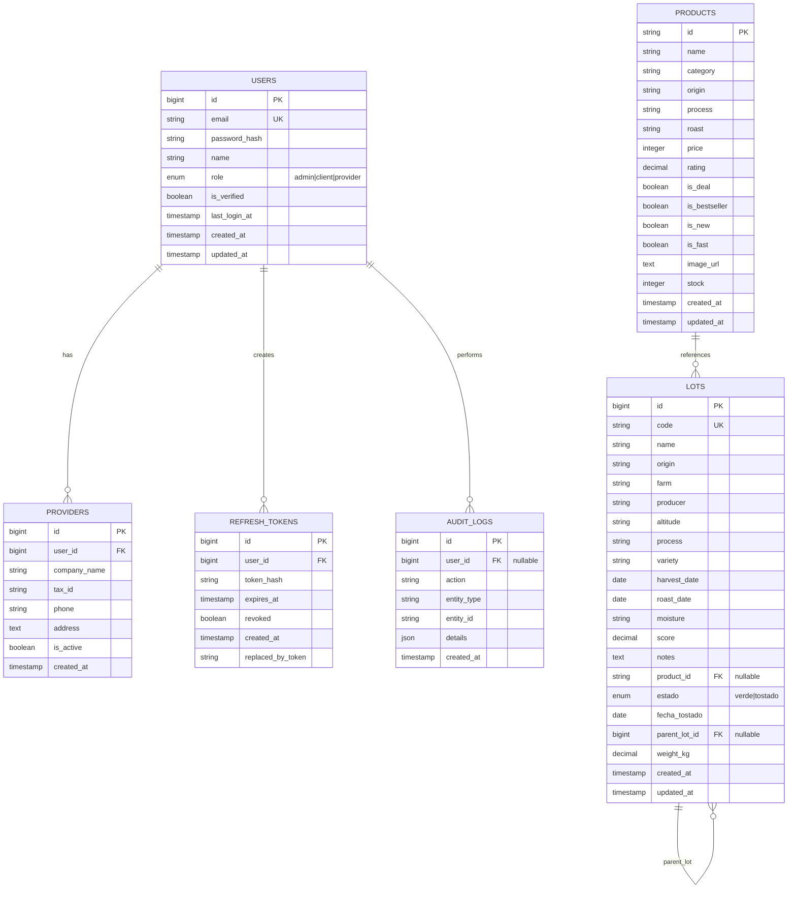

# Diagrama Entidad-Relación - DobleYo Café

## 📊 Diagrama ER (Mermaid)



---

## 📋 Tabla de Entidades

| Entidad            | Descripción                                      | PK              | Relaciones                |
| ------------------ | ------------------------------------------------ | --------------- | ------------------------- |
| **USERS**          | Usuarios del sistema (admin, cliente, proveedor) | id (BIGINT)     | → PROVIDERS (1:0..1)      |
|                    |                                                  |                 | → REFRESH_TOKENS (1:N)    |
|                    |                                                  |                 | → AUDIT_LOGS (1:N)        |
| **PROVIDERS**      | Perfil extendido de proveedores                  | id (BIGINT)     | ← USERS (N:1)             |
| **REFRESH_TOKENS** | Tokens JWT para renovar sesiones                 | id (BIGINT)     | ← USERS (N:1)             |
| **AUDIT_LOGS**     | Registro de auditoría de acciones                | id (BIGINT)     | ← USERS (N:1 nullable)    |
| **PRODUCTS**       | Productos de catálogo                            | id (VARCHAR 50) | → LOTS (1:N)              |
| **LOTS**           | Lotes de café (verde o tostado)                  | id (BIGINT)     | ← PRODUCTS (N:1 nullable) |
|                    |                                                  |                 | → LOTS (1:N auto-ref)     |

---

## 🔑 Relaciones Clave

### 1. **USERS → PROVIDERS** (One-to-Zero-or-One)

- Un usuario puede ser proveedor (opcional)
- Extensión de perfil para roles de proveedor
- Cascada en eliminación

### 2. **USERS → REFRESH_TOKENS** (One-to-Many)

- Un usuario puede tener múltiples refresh tokens activos
- Permite sesiones simultáneas
- Cascada en eliminación

### 3. **USERS → AUDIT_LOGS** (One-to-Many)

- Registro de quién hizo qué y cuándo
- `user_id` es nullable (SET NULL si usuario se elimina)
- Trazabilidad de operaciones

### 4. **PRODUCTS → LOTS** (One-to-Many)

- Un producto puede referenciar múltiples lotes
- `product_id` en LOTS es nullable
- Lotes que no están ligados a producto aún

### 5. **LOTS → LOTS** (Self-Referencing, Hierarchical)

- **Relación crucial para trazabilidad de tostado:**
  - Lote VERDE tiene múltiples SUBLOTES TOSTADOS
  - Campo: `parent_lot_id`
  - Un lote tostado referencia su lote verde padre
  - Permite rastrear: verde → tostado → empaquetado (futuro)

---

## 🌳 Jerarquía de Lotes (Trazabilidad)

```
LOTE VERDE (estado='verde')
├── ID: 123
├── Código: LOTE-001
├── Peso: 100 kg
├── parent_lot_id: NULL
│
└─── LOTE TOSTADO (estado='tostado')
     ├── ID: 456
     ├── Código: LOTE-001-ROAST-20260105
     ├── Peso: 30 kg
     ├── fecha_tostado: 2026-01-05
     ├── parent_lot_id: 123 ← ENLAZA CON VERDE
     │
     └─── BOLSA/EMPAQUETADO (futuro)
          └── Hereda trazabilidad completa
```

---

## 📊 Índices de Optimización

| Tabla          | Índice                  | Campos        | Propósito                     |
| -------------- | ----------------------- | ------------- | ----------------------------- |
| USERS          | idx_users_role          | role          | Búsqueda rápida por rol       |
| PRODUCTS       | idx_products_category   | category      | Filtrado en catálogo          |
| LOTS           | idx_lots_code           | code          | Búsqueda por código QR        |
| LOTS           | idx_lots_product        | product_id    | Relación productos-lotes      |
| LOTS           | idx_lots_estado         | estado        | Inventario (verde vs tostado) |
| LOTS           | idx_lots_parent         | parent_lot_id | Trazabilidad (verde→tostado)  |
| REFRESH_TOKENS | idx_refresh_tokens_user | user_id       | Limpieza de tokens expirados  |

---

## 🔐 Restricciones de Integridad

| Restricción               | Tipo        | Comportamiento                                    |
| ------------------------- | ----------- | ------------------------------------------------- |
| USERS.email               | UNIQUE      | No pueden existir 2 usuarios con mismo email      |
| LOTS.code                 | UNIQUE      | Cada lote tiene identificador único               |
| PROVIDERS.user_id FK      | FOREIGN KEY | Cascada en eliminación (DELETE CASCADE)           |
| REFRESH_TOKENS.user_id FK | FOREIGN KEY | Cascada en eliminación (DELETE CASCADE)           |
| AUDIT_LOGS.user_id FK     | FOREIGN KEY | Set NULL en eliminación (DELETE SET NULL)         |
| PRODUCTS.id FK (en LOTS)  | FOREIGN KEY | Permitido NULL (lote no asignado a producto aún)  |
| LOTS.parent_lot_id FK     | FOREIGN KEY | Set NULL en eliminación (permite lotes huérfanos) |

---

## 💡 Casos de Uso por Entidad

### **USERS + AUTH**

- ✅ Registro de usuarios con rol (admin/client/provider)
- ✅ Autenticación con JWT + refresh tokens
- ✅ Auditoría de accesos y cambios
- ✅ Persistencia de sesión con HttpOnly cookies

### **PROVIDERS**

- ✅ Perfil extendido para proveedores
- ✅ Info tributaria y contacto
- ✅ Control de acceso (is_active)

### **PRODUCTS**

- ✅ Catálogo de café
- ✅ Información de origen, proceso, tostado
- ✅ Metadata: deal, bestseller, new, fast
- ✅ Inventario agregado por lotes

### **LOTS**

- ✅ **Verde:** Control de inventario de café sin tostar
- ✅ **Tostado:** Control de café tostado listo para venta
- ✅ **Trazabilidad:** Rastreo completo verde → tostado
- ✅ **QR:** Código único por lote
- ✅ **Calidad:** Score, notas, proceso

---

## 🚀 Extensiones Futuras

### Tablas por agregar:

1. **ORDERS** - Órdenes de clientes
   - Relación: USERS (1:N), PRODUCTS (M:N vía ORDER_ITEMS)
2. **ORDER_ITEMS** - Items en órden
   - Relación: ORDERS (N:1), PRODUCTS (N:1), LOTS (N:1)
3. **INVENTORY_MOVEMENTS** - Log de movimientos
   - Relación: LOTS (N:1), USERS (N:1)
4. **PACKAGES** - Bolsas empaquetadas

   - Relación: LOTS (N:1), PRODUCTS (N:1)
   - Jerarquía: lote tostado → bolsa → QR

5. **SHIPMENTS** - Envíos
   - Relación: ORDERS (N:1), PACKAGES (N:M)

---

## 📈 Estadísticas Estimadas

- **USERS:** ~10k clientes + 50 admins + 5 proveedores
- **PRODUCTS:** ~50 SKUs únicos
- **LOTS:** ~200-500 lotes/año (verde + tostado)
- **ORDERS:** ~1k-5k órdenes/año
- **AUDIT_LOGS:** ~100k registros/año

**Almacenamiento estimado:** <500 MB en primeros años

---

## ✅ Validación Actual

| Validación                 | Implementada | Ubicación                   |
| -------------------------- | ------------ | --------------------------- |
| Email único                | ✅           | schema.sql (UNIQUE)         |
| Código lote único          | ✅           | schema.sql (UNIQUE)         |
| Peso positivo              | ⏳           | Necesita validación en API  |
| Score 0-100                | ⏳           | Necesita validación en API  |
| Cascada en eliminación     | ✅           | schema.sql (FK constraints) |
| Trazabilidad verde→tostado | ✅           | parent_lot_id + estado      |

---

## 🎯 Resumen Ejecutivo

El modelo ER actual soporta:

- ✅ Multi-rol authentication (admin/client/provider)
- ✅ Trazabilidad completa de lotes (verde → tostado)
- ✅ Auditoría de operaciones
- ✅ Catálogo de productos
- ✅ Gestión de inventario por lote
- ✅ Control de sesiones con refresh tokens

**Listo para escalable:** Las tablas están normalizadas, con índices estratégicos y relaciones bien definidas.
